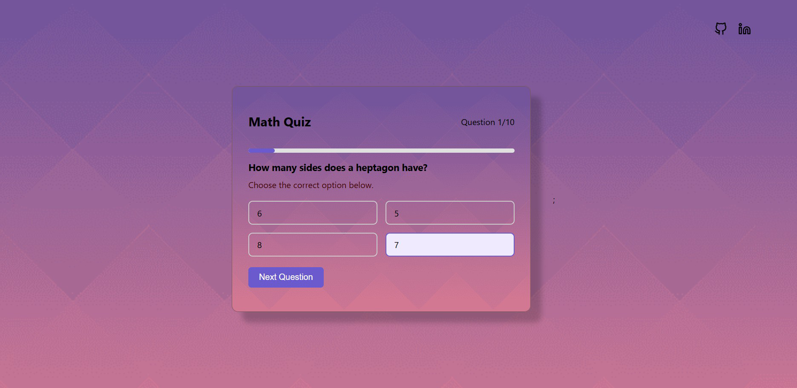

# 🎯 Math Quiz App

A responsive, interactive quiz web app built with HTML, CSS, and JavaScript that fetches live quiz questions from the OpenTDB API.

 

## 🚀 Live Demo

🔗 [Click here to try the app](https://himanshu4812.github.io/QuizApp/)

---

## 📌 Features

- ✅ Fetches 10 random Math questions from OpenTDB API
- ✅ Clean and responsive UI using Flexbox
- ✅ One-question-at-a-time navigation
- ✅ Displays current question number and score
- ✅ “Next Question” and “Restart” button functionality
- ✅ Stylish gradient background with floating circle elements

---

## 🛠️ Tech Stack

- **HTML5**
- **CSS3** (custom styling, Flexbox, gradients)
- **JavaScript (ES6+)**
- **OpenTDB REST API** for quiz data

---

## 🧠 What I Learned

- Making API calls with `fetch()`
- Parsing and displaying JSON data dynamically
- Managing quiz state (score, current question)
- DOM manipulation and event-driven interactions
- Responsive and visually appealing layout design

---

## 💡 Possible Improvements

- Add a timer for each question
- Highlight correct and incorrect answers after submission
- Add localStorage to track high scores
- Add difficulty filters or categories

---

## 📷 Screenshots

> Example:
> 

---

## 👨‍💻 Author

**Himanshu Kumar**  
🎓 Student Developer | 💼 Intern @ ApexPlanet Software Pvt Ltd

---

## 📬 Feedback & Contributions

Feel free to open an issue or submit a PR with suggestions or improvements!  
✨ Star the repo if you like it!

---

### License

This project is open-source and free to use under the [MIT License](./LICENSE).
